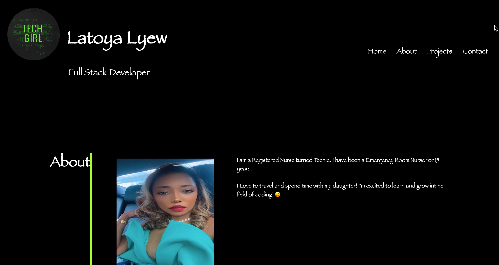

# Professional-Portfolio

This challenges is the begining stages of building a professional portfolio for future employers.

## Criteria

* Display developer's name
* Recent photo
* Links to various sections such as about me and contact
* Links navigate to corresponding section on page
* Titled images of work samples
* Images deploy to work samples
* MediaQuery used to make page responsive on various screens and devices

## Screenshot

## Application

Click the link to visit the application

https://lflyew.github.io/Professional-Portfolio/

## Author
[@LatoyaLyew] (https://github.com/lflyew)
